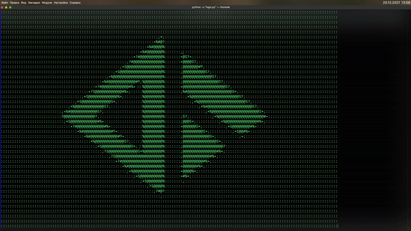

# RTUITLab-logo

 RTUITLab-logo printed out on the console with Python!

# Running this code/Pre-requisites

You can either `git clone` or download a ZIP of this repository.

 `git clone https://github.com/RTUITLab/ascii-lab-logo`

Then, ensure that you set your terminal to the directory of this repository.

 `cd bad-apple`

Install the necessary dependencies and packages by using:

 `pip install -r requirements.txt`

And to run the code:

 `python logo.py`

And just follow the on-screen prompts.
